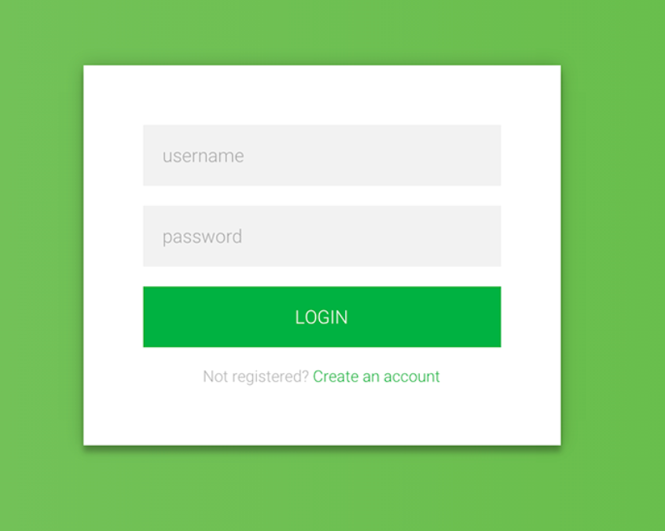
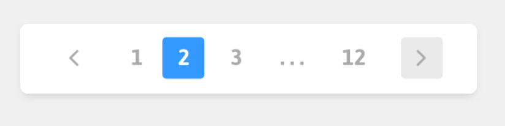

## Student Implementation/Notes
1. For my login example I have the form hooked up so that the username and password is logged to the console on login button press, as well as it clearing both the fields upon clicking it.

2. For the pagination example, I added a small supplementary form purely for ease of use on testing it that I will be removing in subsquent projects should we reuse these components. Unfortunately my logic for the pagination is a tad bit messy due to me wanting to have the pages "scroll" along when moving to the left or right versus for example if the buttons stayed stationary at numbers 1-10, and only rolling over to 11-20 after clicking the right arrow once 10 had been selected. Besides that effect, as noted from the supplementary form the pagination is fully customizable with being able to handle dynamic amounts of pagination size, as well as total number of pages. The left and right buttons also properly disable when at the very first or last page but unfortunately I did not have enough time to style them to make it extremely obvious to the user.

3. For the radio button implementation I have also tried to make it more flexible by having it maintain state that contains an array of options that would most likely be passed down to the component as props. While currently their is some default options for the array it would be easy to swap it to be able to handle options passed down as props to the component so that it can handle a dynamic amount of options. I have also decided to use a hashmap to keep track of disabled options so it should be simple as well to add and take away disabled options as once inside the component will automatically map through the options and disable the blacklisted options. By default I only currently have the orange option disabled and as with the previous component, I did not have enough time to style it to make it obvious.

Final note - Unfortunately I mostly only had time to focus on functionality this time around and will still be styling it later.

## Homework 3

In this assignment we will start to use React components. The goal of this assignment is to compose generic smaller components into larger more complex components. You will have to think about the information passed (props) from the larger parent components down to their child components. The components we will be creating are a login form, pager, and radio buttons. Below are some examples of how these might look:

  1. Login form example 
  
  

  2. Pager example
  
  

  3. Radio buttons example
  
  


## Deliverables

1. Layout the login form, pager, and radio buttons by composing generic components (I see 2-3 generic components you could make) that will be located in `src/components`.
2. Figure out what props you want to pass down to each component. Example: let's say we created a button component some, but not limited to, of the props that I might pass down could be a enable/disable flag, a way to change the color, and a button size. 
3. Feel free to add custom styling any new generic components you want.
4. For generic components that are taking event handlers (e.g. `onClick`, `onChange`, etc...), you are going to want to use `console.log` in the parent component so that you can see if your event is firing. Example: 
```
const Input = ({ onChange }) => {
  return <input type="text" onChange={e => onChange(e.target.value)} />
}

const SomeComponentThatUsesInput = () => {
  return <div>
    <Input onChange={v => console.log(`Hello from App - Input Value is: ${v}`)}/>
  </div>
}
```

## Bonus
- Pager: If you have hardcoded a pager that works 1 to 10, then how might we modify it to be a bit more generic? What props can I pass in that will make the component more configurable?
- Radio buttons: If you hardcoded "Apple", "Pear", and "Orange", then how might you modify it to take in an array of button configurations? What information might we need to determine if a button is active? 

## How to run the project

It is required that you have `node` and `npm` installed. In the project directory, you will run:

`npm i && npm start`

The app will start in the development mode. Open [http://localhost:4000](http://localhost:4000) to view it in the browser. The page will reload if you make edits. You will also see any lint errors in the console.
